# Machine Learning Refined: Notes, Exercises, and Jupyter notebooks [](https://twitter.com/intent/tweet?text=Machine%20Learning%20Refined:%20notes,%20exercises,%20and%20Jupyter%20notebooks%20&url=https://github.com/jermwatt/machine_learning_refined)


Below you will find a range of resources that complement the 2nd edition of Machine Learning Refined (published by Cambridge University Press).

# Table of Contents
- [Sample chapters from the 2nd edition](https://github.com/jermwatt/machine_learning_refined/tree/gh-pages/sample_chapters/2nd_ed)
- [A sampler of widgets / pedagogy](#a-sampler-of-widgets-and-our-pedagogy)
- [Online notes (jupyter notebooks)](#online-notes)
- [What is new in the second edition?](#what-is-new-in-the-second-edition)
- [How to use the book](#how-to-use-the-book)
- [Technical prerequisites](#technical-prerequisites)
- [Coding exercises](#coding-exercises)
- [Slides and additional instructor resources](#slides-and-additional-instructor-resources)
- [Errata](#errata)
- [Get a copy of the book](#get-a-copy-of-the-book)
- [Reviews and Endorsements](#reviews-and-endorsements)
- [Software installation and dependencies](#software-installation-and-dependencies)
- [Contact](#contact)

<br><br><br>

## A sampler of widgets and our pedagogy
[(Back to top)](#table-of-contents)

We believe mastery of a certain machine learning concept/topic is achieved only when the answer to each of the following three questions is affirmative.

1. **`Intuition`** Can you describe the idea with a simple picture?
2. **`Mathematical derivation`** Can you express your intuition in mathematical notation and derive underlying models/cost functions?   
3. **`Implementation`** Can you code up your derivations in a programming language, say Python, without using high-level libraries? 

<br>

**`Intuition comes first.`** Intuitive leaps precede intellectual ones, and because of this we have included over 300 color illustrations in the book that have been meticulously designed to enable an intuitive grasp
of technical concepts. Many of those illustrations are snapshots of animations that show convergence of certain algorithms, 
evolution of certain models from underfitting all the way to overfitting, etc. This sort of concepts can be illustrated and intuited best using animations (as opposed to static figures).
 You'll find a large number of such animations in this repository -- which you can modify yourself too via the raw Jupyter notebook version of these notes. Here are just a few examples:<br><br> 

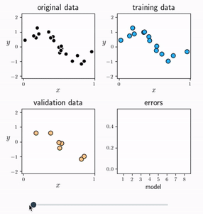 |  |  
---|---|---
Cross-validation (regression) | Cross-validation (two-class classification) | Cross-validation (multi-class classification)

<br><br>

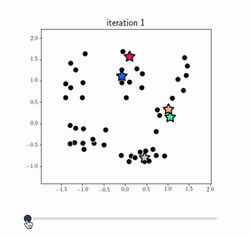 | 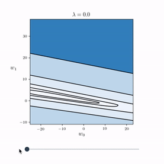 | 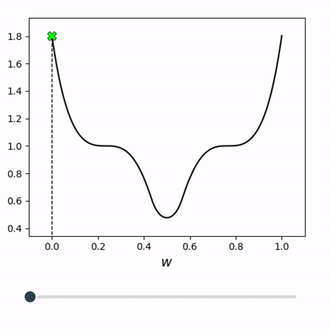 
---|---|---
K-means clustering | Feature normalization| Normalized gradient descent

<br><br>

 |  |  
---|---|---
Rotation | Convexification | Dogification!

<br><br>

 | 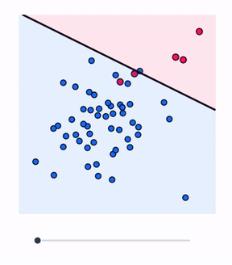 |  
---|---|---
A nonlinear transformation | Weighted classification | The moving average

<br><br>

 | 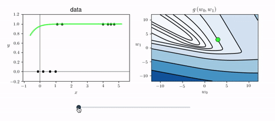 
---|---
Batch normalization | Logistic regression

<br><br>

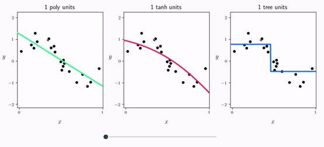 | 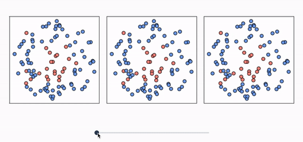 
---|---
Polynomials vs. NNs vs. Trees (regression) | Polynomials vs. NNs vs. Trees (classification)

<br><br>

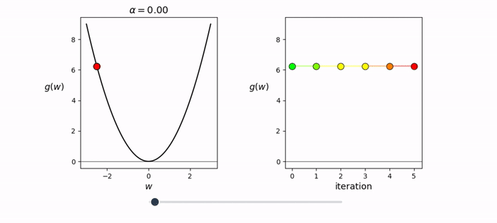 |  
---|---
Changing gradient descent's steplength (1d) | Changing gradient descent's steplength (2d)

<br><br>

 |  
---|---
Convex combination of two functions | Taylor series approximation

<br><br>

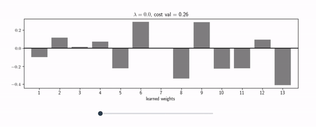 | 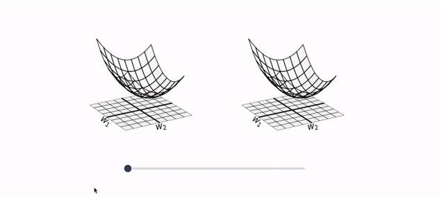 
---|---
Feature selection via regularization | Secant planes

<br><br>

 |  
---|---
Function approximation with a neural network | A regression tree

<br><br>

**`Mathematical optimization: the workhorse of machine learning.`** We highly emphasize the importance of mathematical optimization in our treatment of machine learning. Optimization is the workhorse of machine learning
and is fundamental at many levels – from the tuning of individual models to
the general selection of appropriate nonlinearities via cross-validation. Because
of this a strong understanding of mathematical optimization is requisite if one
wishes to deeply understand machine learning, and if one wishes to be able to
implement fundamental algorithms. Part I of the book provides a complete introduction to mathematical optimization, covering zero-, first-, and second-order methods, that are relied upon later in deriving and tuning machine learning models.<br><br>

**`Learning by doing.`** We place significant emphasis on the design and implementation of algorithms throughout the text with implementations of fundamental
algorithms given in Python. These fundamental examples can then be used as
building blocks for the reader to help complete the text’s programming exercises, allowing them to ”get their hands dirty” and ”learn by doing,” practicing
the concepts introduced in the body of the text. While in principle any programming language can be used to complete the text’s coding exercises, we highly
recommend using Python for its ease of use and large support community. We
also recommend using the open-source Python libraries NumPy, autograd, and
matplotlib, as well as the Jupyter notebook editor to make implementing and
testing code easier. A complete set of installation instructions, datasets, as well
as starter notebooks can be found in this repository.<br><br>


## Online notes 
[(Back to top)](#table-of-contents)

A select number of Chapters/Sections are highlighted below and are linked to HTML notes that served as *early drafts* for the second edition of the textbook. You can find these html files as well as Jupyter notebooks which created them in the `notes` subdirectory. <br><br> 

<p align="center"></p>
<br>

### Chapter 1. Introduction to Machine Learning

1.1 Introduction<br>
1.2 Distinguishing Cats from Dogs: a Machine Learning Approach<br> 
1.3 The Basic Taxonomy of Machine Learning Problems<br> 
1.4 Mathematical Optimization<br>
1.5 Conclusion<br> 


### Chapter 2. Zero-Order Optimization Techniques

2.1 Introduction<br> 
[2.2 The Zero-Order Optimality Condition](https://jermwatt.github.io/machine_learning_refined/notes/2_Zero_order_methods/2_2_Zero.html)  
[2.3 Global Optimization Methods](https://jermwatt.github.io/machine_learning_refined/notes/2_Zero_order_methods/2_3_Global.html)    
[2.4 Local Optimization Methods](https://jermwatt.github.io/machine_learning_refined/notes/2_Zero_order_methods/2_4_Local.html)   
[2.5 Random Search](https://jermwatt.github.io/machine_learning_refined/notes/2_Zero_order_methods/2_5_Random.html)  
[2.6 Coordinate Search and Descent](https://jermwatt.github.io/machine_learning_refined/notes/2_Zero_order_methods/2_6_Coordinate.html)<br>
2.7 Conclusion<br>
2.8 Exercises<br>
 
 
### Chapter 3. First-Order Optimization Techniques

3.1 Introduction<br> 
[3.2 The First-Order Optimality Condition](https://jermwatt.github.io/machine_learning_refined/notes/3_First_order_methods/3_2_First.html)       
[3.3 The Geometry of First-Order Taylor Series](https://jermwatt.github.io/machine_learning_refined/notes/3_First_order_methods/3_4_Tangent.html)<br> 
3.4 Computing Gradients Efficiently    
[3.5 Gradient Descent](https://jermwatt.github.io/machine_learning_refined/notes/3_First_order_methods/3_6_Descent.html)   
[3.6 Two Natural Weaknesses of Gradient Descent](https://jermwatt.github.io/machine_learning_refined/notes/3_First_order_methods/3_7_Problems.html)   
3.7 Conclusion<br>
3.8 Exercises<br>


### Chapter 4. Second-Order Optimization Techniques

[4.1 The Second-Order Optimality Condition](https://jermwatt.github.io/machine_learning_refined/notes/4_Second_order_methods/4_3_Second.html)   
4.2 The Geometry of Second-Order Taylor Series<br>
[4.3 Newton’s Method](https://jermwatt.github.io/machine_learning_refined/notes/4_Second_order_methods/4_4_Newtons.html)   
[4.4 Two Natural Weaknesses of Newton’s Method](https://jermwatt.github.io/machine_learning_refined/notes/4_Second_order_methods/4_5_Problems.html)   
4.5 Conclusion<br>
4.6 Exercises<br> 


### Chapter 5. Linear Regression

5.1 Introduction<br>
[5.2 Least Squares Linear Regression](https://jermwatt.github.io/machine_learning_refined/notes/5_Linear_regression/5_2_Least.html)   
[5.3 Least Absolute Deviations](https://jermwatt.github.io/machine_learning_refined/notes/5_Linear_regression/5_3_Absolute.html)   
[5.4 Regression Quality Metrics](https://jermwatt.github.io/machine_learning_refined/notes/5_Linear_regression/5_4_Metrics.html)   
[5.5 Weighted Regression](https://jermwatt.github.io/machine_learning_refined/notes/5_Linear_regression/5_5_Weighted.html)   
[5.6 Multi-Output Regression](https://jermwatt.github.io/machine_learning_refined/notes/5_Linear_regression/5_6_Multi.html)<br>
5.7 Conclusion<br>
5.8 Exercises<br>
5.9 Endnotes<br> 


### Chapter 6. Linear Two-Class Classification

6.1 Introduction<br>
[6.2 Logistic Regression and the Cross Entropy Cost](https://jermwatt.github.io/machine_learning_refined/notes/6_Linear_twoclass_classification/6_2_Cross_entropy.html)   
[6.3 Logistic Regression and the Softmax Cost](https://jermwatt.github.io/machine_learning_refined/notes/6_Linear_twoclass_classification/6_3_Softmax.html)   
[6.4 The Perceptron](https://jermwatt.github.io/machine_learning_refined/notes/6_Linear_twoclass_classification/6_4_Perceptron.html)   
[6.5 Support Vector Machines](https://jermwatt.github.io/machine_learning_refined/notes/6_Linear_twoclass_classification/6_5_SVMs.html)  
[6.6 Which Approach Produces the Best Results?](https://jermwatt.github.io/machine_learning_refined/notes/6_Linear_twoclass_classification/6_7_Comparison.html)<br>
[6.7 The Categorical Cross Entropy Cost](https://jermwatt.github.io/machine_learning_refined/notes/6_Linear_twoclass_classification/6_6_Categorical.html)    
[6.8 Classification Quality Metrics](https://jermwatt.github.io/machine_learning_refined/notes/6_Linear_twoclass_classification/6_8_Metrics.html)   
[6.9 Weighted Two-Class Classification](https://jermwatt.github.io/machine_learning_refined/notes/6_Linear_twoclass_classification/6_9_Weighted.html)<br>
6.10 Conclusion<br>
6.11 Exercises<br>  


### Chapter 7. Linear Multi-Class Classification

7.1 Introduction<br>
[7.2 One-versus-All Multi-Class Classification](https://jermwatt.github.io/machine_learning_refined/notes/7_Linear_multiclass_classification/7_2_OvA.html)   
[7.3 Multi-Class Classification and the Perceptron](https://jermwatt.github.io/machine_learning_refined/notes/7_Linear_multiclass_classification/7_3_Perceptron.html)   
[7.4 Which Approach Produces the Best Results?](https://jermwatt.github.io/machine_learning_refined/notes/7_Linear_multiclass_classification/7_4_Comparison.html)   
[7.5 The Categorical Cross Entropy Cost Function](https://jermwatt.github.io/machine_learning_refined/notes/7_Linear_multiclass_classification/7_5_Categorical.html)   
[7.6 Classification Quality Metrics](https://jermwatt.github.io/machine_learning_refined/notes/7_Linear_multiclass_classification/7_6_Metrics.html)<br>
7.7 Weighted Multi-Class Classification<br>
7.8 Stochastic and Mini-Batch Learning<br>
7.9 Conclusion<br>
7.10 Exercises<br>  


### Chapter 8. Linear Unsupervised Learning

8.1 Introduction<br>
8.2 Fixed Spanning Sets, Orthonormality, and Projections<br> 
8.3 The Linear Autoencoder and Principal Component Analysis<br> 
[8.4 Recommender Systems](https://jermwatt.github.io/machine_learning_refined/notes/8_Linear_unsupervised_learning/8_4_Recommender.html)<br> 
[8.5 K-Means Clustering](https://jermwatt.github.io/machine_learning_refined/notes/8_Linear_unsupervised_learning/8_5_Kmeans.html)<br>
[8.6 General Matrix Factorization Techniques](https://jermwatt.github.io/machine_learning_refined/notes/8_Linear_unsupervised_learning/8_6_Factorization.html)<br> 
8.7 Conclusion<br> 
8.8 Exercises<br>
8.9 Endnotes<br>


### Chapter 9. Feature Engineering and Selection

9.1 Introduction<br>
[9.2 Histogram Features](https://jermwatt.github.io/machine_learning_refined/notes/9_Feature_engineer_select/9_2_Histogram.html)   
[9.3 Feature Scaling via Standard Normalization](https://jermwatt.github.io/machine_learning_refined/notes/9_Feature_engineer_select/9_3_Scaling.html)   
[9.4 Imputing Missing Values in a Dataset](https://jermwatt.github.io/machine_learning_refined/notes/9_Feature_engineer_select/9_4_Cleaning.html)   
[9.5 Feature Scaling via PCA-Sphering](https://jermwatt.github.io/machine_learning_refined/notes/9_Feature_engineer_select/9_5_PCA_sphereing.html)   
[9.6 Feature Selection via Boosting](https://jermwatt.github.io/machine_learning_refined/notes/9_Feature_engineer_select/9_6_Boosting.html)   
[9.7 Feature Selection via Regularization](https://jermwatt.github.io/machine_learning_refined/notes/9_Feature_engineer_select/9_7_Regularization.html)  
9.8 Conclusion<br>
9.9 Exercises<br>


### Chapter 10. Principles of Nonlinear Feature Engineering

10.1 Introduction<br>
[10.2 Nonlinear Regression](https://jermwatt.github.io/machine_learning_refined/notes/10_Nonlinear_intro/10_2_Regression.html)  
[10.3 Nonlinear Multi-Output Regression](https://jermwatt.github.io/machine_learning_refined/notes/10_Nonlinear_intro/10_3_MultReg.html)  
[10.4 Nonlinear Two-Class Classification](https://jermwatt.github.io/machine_learning_refined/notes/10_Nonlinear_intro/10_4_Twoclass.html)  
[10.5 Nonlinear Multi-Class Classification](https://jermwatt.github.io/machine_learning_refined/notes/10_Nonlinear_intro/10_5_Multiclass.html)  
[10.6 Nonlinear Unsupervised Learning](https://jermwatt.github.io/machine_learning_refined/notes/10_Nonlinear_intro/10_6_Unsupervised.html)<br>
10.7 Conclusion<br>
10.8 Exercises<br>  


### Chapter 11. Principles of Feature Learning

[11.1 Introduction](https://jermwatt.github.io/machine_learning_refined/notes/11_Feature_learning/11_1_Introduction.html) <br>
[11.2 Universal Approximators](https://jermwatt.github.io/machine_learning_refined/notes/11_Feature_learning/11_2_Universal.html) <br>
[11.3 Universal Approximation of Real Data](https://jermwatt.github.io/machine_learning_refined/notes/11_Feature_learning/11_3_Real_approximation.html)  <br>
[11.4 Naive Cross-Validation](https://jermwatt.github.io/machine_learning_refined/notes/11_Feature_learning/11_4_Cross_validation.html)  <br>
[11.5 Efficient Cross-Validation via Boosting](https://jermwatt.github.io/machine_learning_refined/notes/11_Feature_learning/11_5_Boosting.html)   <br>
[11.6 Efficient Cross-Validation via Regularization](https://jermwatt.github.io/machine_learning_refined/notes/11_Feature_learning/11_6_Regularization.html)  <br>
11.7 Testing Data<br>
11.8 Which Universal Approximator Works Best in Practice?<br>
[11.9 Bagging Cross-Validated Models](https://jermwatt.github.io/machine_learning_refined/notes/11_Feature_learning/11_9_Bagging.html) <br>
[11.10 K-Fold Cross-Validation](https://jermwatt.github.io/machine_learning_refined/notes/11_Feature_learning/11_10_Kfolds.html)  <br>
11.11 When Feature Learning Fails<br>
11.12 Conclusion<br>
11.13 Exercises<br>


### Chapter 12. Kernel Methods

12.1 Introduction<br>
12.2 Fixed-Shape Universal Approximators<br>
12.3 The Kernel Trick<br> 
12.4 Kernels as Measures of Similarity<br> 
12.5 Optimization of Kernelized Models<br>
12.6 Cross-Validating Kernelized Learners<br> 
12.7 Conclusion<br> 
12.8 Exercises<br>

  
### Chapter 13. Fully Connected Neural Networks

13.1 Introduction<br>
[13.2 Fully Connected Neural Networks](https://jermwatt.github.io/machine_learning_refined/notes/13_Multilayer_perceptrons/13_2_Multi_layer_perceptrons.html)  
13.3 Activation Functions<br>
13.4 The Backpropagation Algorithm<br>
[13.5 Optimization of Neural Network Models](https://jermwatt.github.io/machine_learning_refined/notes/13_Multilayer_perceptrons/13_3_Optimization.html)   
[13.6 Batch Normalization](https://jermwatt.github.io/machine_learning_refined/notes/13_Multilayer_perceptrons/13_6_Batch_normalization.html)  
[13.7 Cross-Validation via Early Stopping](https://jermwatt.github.io/machine_learning_refined/notes/13_Multilayer_perceptrons/13_7_early_stopping.html)  
13.8 Conclusion<br>
13.9 Exercises<br> 


### Chapter 14. Tree-Based Learners

14.1 Introduction<br>
14.2 From Stumps to Deep Trees<br>
14.3 Regression Trees<br>
14.4 Classification Trees<br>
14.5 Gradient Boosting<br>
14.6 Random Forests<br>
14.7 Cross-Validation Techniques for Recursively Defined Trees<br>
14.8 Conclusion<br>
14.9 Exercises<br>


### Appendix A. Advanced First- and Second-Order Optimization Methods

A.1 Introduction<br>
[A.2 Momentum-Accelerated Gradient Descent](https://jermwatt.github.io/machine_learning_refined/notes/3_First_order_methods/3_8_Momentum.html)<br> 
[A.3 Normalized Gradient Descent](https://jermwatt.github.io/machine_learning_refined/notes/3_First_order_methods/3_9_Normalized.html)<br>
[A.4 Advanced Gradient-Based Methods](https://jermwatt.github.io/machine_learning_refined/notes/3_First_order_methods/3_10_Advanced.html)    
[A.5 Mini-Batch Optimization](https://jermwatt.github.io/machine_learning_refined/notes/3_First_order_methods/3_11_Minibatch.html)<br>
[A.6 Conservative Steplength Rules](https://jermwatt.github.io/machine_learning_refined/notes/3_First_order_methods/3_12_Conservative.html)  
A.7 Newton’s Method, Regularization, and Nonconvex Functions<br>
A.8 Hessian-Free Methods<br> 


### Appendix B. Derivatives and Automatic Differentiation

B.1 Introduction<br> 
B.2 The Derivative<br>
B.3 Derivative Rules for Elementary Functions and Operations<br> 
B.4 The Gradient<br>
B.5 The Computation Graph<br>
B.6 The Forward Mode of Automatic Differentiation<br>
B.7 The Reverse Mode of Automatic Differentiation<br>
B.8 Higher-Order Derivatives<br>
B.9 Taylor Series<br>
[B.10 Using the autograd Library](https://jermwatt.github.io/machine_learning_refined/notes/3_First_order_methods/3_5_Automatic.html)


### Appendix C. Linear Algebra

C.1 Introduction<br>
[C.2 Vectors and Vector Operations](https://jermwatt.github.io/machine_learning_refined/notes/16_Linear_algebra/16_2_Vectors.html)  
[C.3 Matrices and Matrix Operations](https://jermwatt.github.io/machine_learning_refined/notes/16_Linear_algebra/16_3_Matrices.html)<br> 
[C.4 Eigenvalues and Eigenvectors](https://jermwatt.github.io/machine_learning_refined/notes/16_Linear_algebra/16_4_Eigen.html)<br> 
[C.5 Vector and Matrix Norms](https://jermwatt.github.io/machine_learning_refined/notes/16_Linear_algebra/16_5_Norms.html)<br><br><br>


## What is new in the second edition?
[(Back to top)](#table-of-contents)

The second edition of this text is a complete revision of our first endeavor, with
virtually every chapter of the original rewritten from the ground up and eight
new chapters of material added, doubling the size of the first edition. Topics from
the first edition, from expositions on gradient descent to those on One-versusAll classification and Principal Component Analysis have been reworked and
polished. A swath of new topics have been added throughout the text, from
derivative-free optimization to weighted supervised learning, feature selection,
nonlinear feature engineering, boosting-based cross-validation, and more.
While heftier in size, the intent of our original attempt has remained unchanged: to explain machine learning, from first principles to practical implementation, in the simplest possible terms.<br><br> 


## How to use the book?
[(Back to top)](#table-of-contents)

Example ”roadmaps” shown below provide suggested paths
for navigating the text based on a variety of learning outcomes and university
courses taught using the present book.

##### Recommended study roadmap for a course on the essentials of machine learning, including requisite chapters (left column), sections (middle column), and corresponding topics (right column). This essentials plan is suitable for time-constrained courses (in quarter-based programs and universities) or self-study, or where machine learning is not the sole focus but a key component of some broader course of study. 
<p align="center">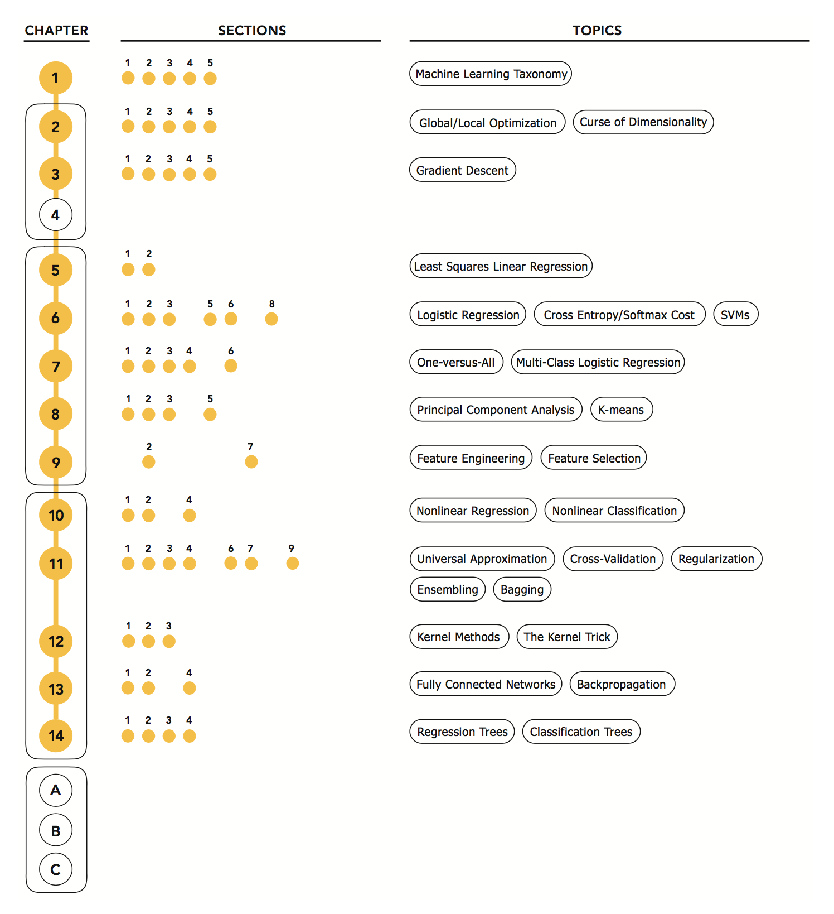</p>
<br><br><br>

##### Recommended study roadmap for a full treatment of standard machine learning subjects, including chapters, sections, as well as corresponding topics to cover. This plan entails a more in-depth coverage of machine learning topics compared to the essentials roadmap given above, and is best suited for senior undergraduate/early graduate students in semester-based programs and passionate independent readers.
<p align="center">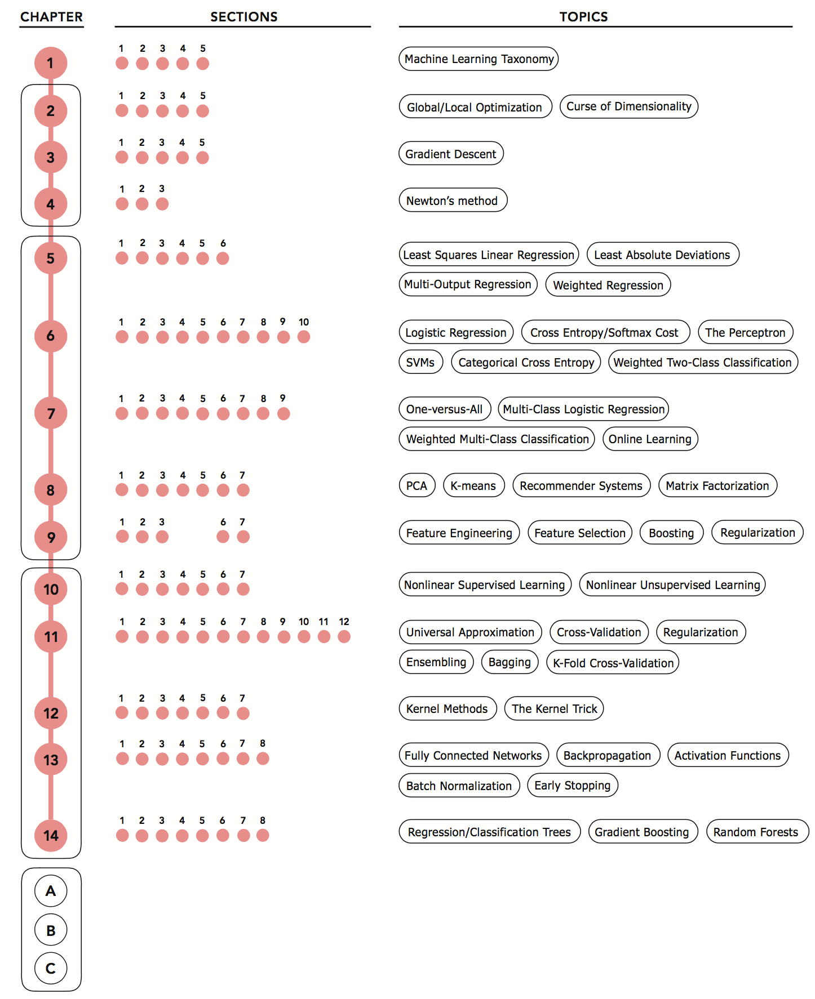</p>
<br><br><br>

##### Recommended study roadmap for a course on mathematical optimization for machine learning and deep learning, including chapters, sections, as well as topics to cover.
<p align="center"></p>
<br><br><br>

##### Recommended study roadmap for an introductory portion of a course on deep learning, including chapters, sections, as well as topics to cover.
<p align="center">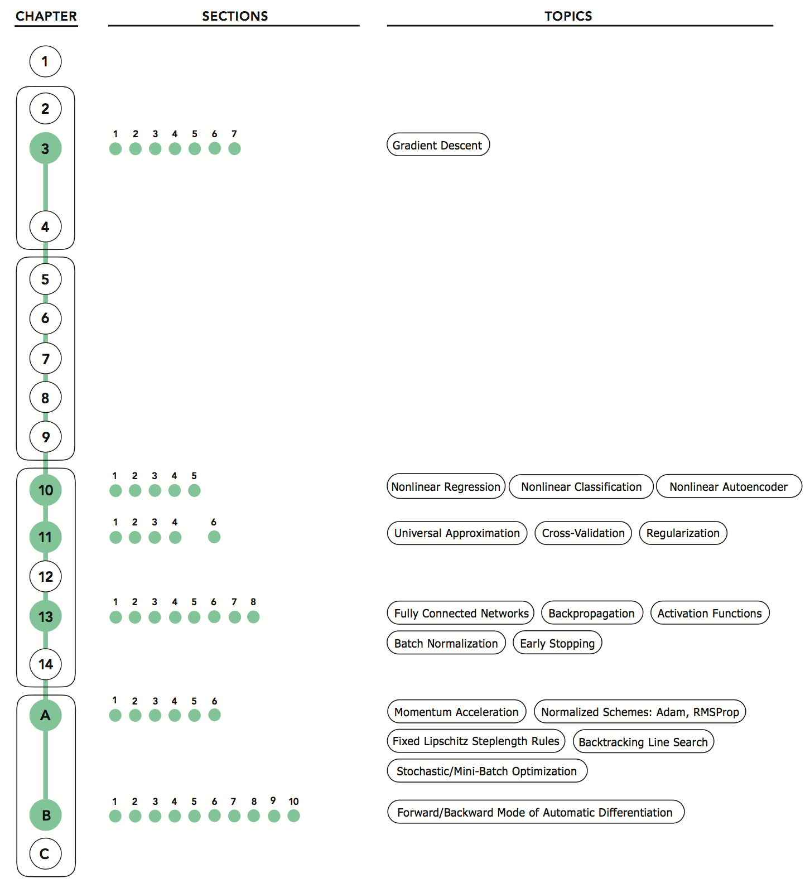</p>
<br><br><br>


## Technical prerequisites
[(Back to top)](#table-of-contents)

To make full use of the text one needs only a basic understanding of vector algebra (mathematical
functions, vector arithmetic, etc.) and computer programming (for example,
basic proficiency with a dynamically typed language like Python). We provide
complete introductory treatments of other prerequisite topics including linear
algebra, vector calculus, and automatic differentiation in the appendices of the
text.<br><br>


## Coding exercises
[(Back to top)](#table-of-contents)

In the [mlrefined_exercises](https://github.com/jermwatt/machine_learning_refined/tree/gh-pages/mlrefined_exercises) directory you can find starting wrappers for coding exercises from the first and second editions of the text.<br><br>


## Slides and additional instructor resources
[(Back to top)](#table-of-contents)

[Slides for the 2nd edition of the text](https://github.com/jermwatt/machine_learning_refined/tree/gh-pages/presentations/2nd_edition) are available in pptx, jupyter, and reveal.js formats.  [Slides for the 1st edition of the text](https://github.com/jermwatt/machine_learning_refined/tree/gh-pages/presentations/1st_edition) are also available.

Instructors may request a copy of this text for examination from the [publisher's website](http://cambridge.force.com/Samples?isbn=9781108480727&Title=Machine%20Learning%20Refined&Author=Watt/Borhani/Katsaggelos). Cambridge University Press can also provide you with the **solution manual** to both editions of the text.<br><br>


## Errata
[(Back to top)](#table-of-contents)

<a target="_blank" href="https://github.com/jermwatt/machine_learning_refined/blob/gh-pages/sample_chapters/errata/errata.pdf">Here</a> you can find a regularly updated errata sheet for the second edition of the text. Please report any typos, bugs, broken links, etc., in the **Issues Section** of this repository or by contacting us directly via email (see contact section for more info).<br><br>


## Get a copy of the book
[(Back to top)](#table-of-contents)

- [Free sample chapters in pdf format]((https://github.com/jermwatt/machine_learning_refined/tree/gh-pages/sample_chapters/2nd_ed))
- From [Cambridge University Press](https://www.cambridge.org/us/academic/subjects/engineering/communications-and-signal-processing/machine-learning-refined-foundations-algorithms-and-applications-2nd-edition?format=HB)
- From [Amazon](https://www.amazon.com/Machine-Learning-Refined-Foundations-Applications/dp/1108480721)
- From [Barnes & Noble](https://www.barnesandnoble.com/w/machine-learning-refined-jeremy-watt/1136155294?ean=9781108480727)
<br><br>

## Reviews and Endorsements
[(Back to top)](#table-of-contents)

> An excellent book that treats the fundamentals of machine learning from basic principles to practical implementation. The book is suitable as a text for senior-level and first-year graduate courses in engineering and computer science. It is well organized and covers basic concepts and algorithms in mathematical optimization methods, linear learning, and nonlinear learning techniques. The book is nicely illustrated in multiple colors and contains numerous examples and coding exercises using Python.

**John G. Proakis**, University of California, San Diego
<br><br>

> Some machine learning books cover only programming aspects, often relying on outdated software tools; some focus exclusively on neural networks; others, solely on theoretical foundations; and yet more books detail advanced topics for the specialist. This fully revised and expanded text provides a broad and accessible introduction to machine learning for engineering and computer science students. The presentation builds on first principles and geometric intuition, while offering real-world examples, commented implementations in Python, and computational exercises. I expect this book to become a key resource for students and researchers.

**Osvaldo Simeone**, King's College, London
<br><br>

> This book is great for getting started in machine learning. It builds up the tools of the trade from first principles, provides lots of examples, and explains one thing at a time at a steady pace. The level of detail and runnable code show what's really going when we run a learning algorithm.

**David Duvenaud**, University of Toronto
<br><br>

> This book covers various essential machine learning methods (e.g., regression, classification, clustering, dimensionality reduction, and deep learning) from a unified mathematical perspective of seeking the optimal model parameters that minimize a cost function. Every method is explained in a comprehensive, intuitive way, and mathematical understanding is aided and enhanced with many geometric illustrations and elegant Python implementations.

**Kimiaki Sihrahama**, Kindai University, Japan
<br><br>

> Books featuring machine learning are many, but those which are simple, intuitive, and yet theoretical are extraordinary 'outliers'. This book is a fantastic and easy way to launch yourself into the exciting world of machine learning, grasp its core concepts, and code them up in Python or Matlab. It was my inspiring guide in preparing my 'Machine Learning Blinks' on my BASIRA YouTube channel for both undergraduate and graduate levels.

**Islem Rekik**, Director of the Brain And SIgnal Research and Analysis (BASIRA) Laboratory
<br><br>


## Software installation and dependencies
[(Back to top)](#table-of-contents)

After cloning this repository and entering the directory we recommend one of three methods for successfully running the Jupyter notebooks contained therein. 


### Docker method (**strongly recommended**)

After installing [docker and docker-compose on your machine](https://docs.docker.com/compose/install/)  
traverse to this repo at your terminal and type 

```docker-compose up -d```

When running this command the first time an associated docker image is pulled from DockerHub.

Then in any web browser go to 

```localhost:8888```

to view the repository contents - including jupyter notebooks.


### Anaconda method

After installing [Anaconda Python 3 distribution](https://www.anaconda.com/download) on your machine, cd into this repo's directory and follow these steps to create a conda virtual environment to view its contents and notebooks.

First, create the environment

```conda create python=3.6 --name mlr2 --file requirements.txt```

Then activate it

```conda activate mlr2```

Run jupyter via the command below

```jupyter notebook --port=8888 --ip=0.0.0.0 --allow-root --NotebookApp.token=''```

And finally, open any web browser and traverse to

```localhost:8888```

to view the repository contents - including jupyter notebooks.


### pip3 method
Using Python3 and pip3 on your machine, cd into this repo's directory and follow these steps to install the required packages.

First install Python requirements

```pip3 install -r requirements.txt```

Run jupyter via the command below

```jupyter notebook --port=8888 --ip=0.0.0.0 --allow-root --NotebookApp.token=''```

And finally, open any web browser and traverse to

```localhost:8888```

to view the repository contents - including jupyter notebooks.


## Contact
[(Back to top)](#table-of-contents)

This repository is in active development by [Jeremy Watt](mailto:jermwatt@gmail.com) and [Reza Borhani](mailto:rzbrhn@gmail.com). Please do not hesitate to reach out with comments, questions, typos, etc.
