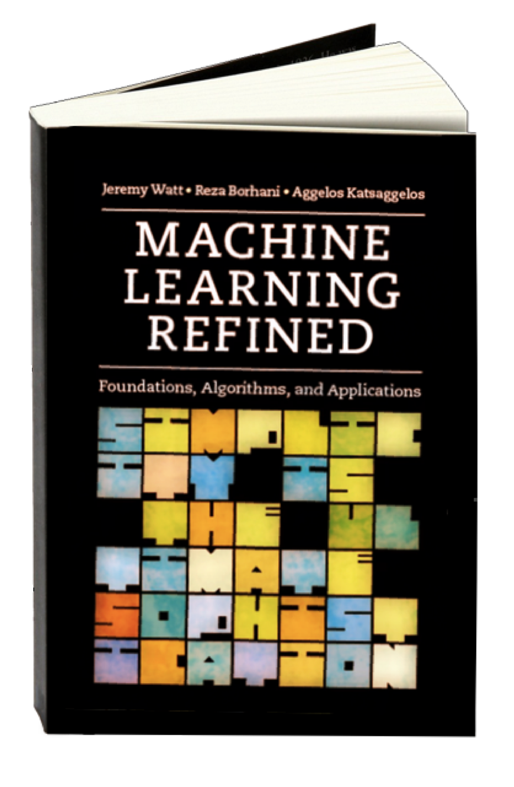

# Machine Learning Refined: Notes, Exercises, and Jupyter notebooks 

<strong>Publisher:</strong> Cambridge University Press   
<strong>First edition:</strong> November 2016  
<strong>Second edition:</strong> January 2020 (expected)    

# Table of contents

- [A little sampler first](#a-little-sampler-first)
- [What is in this book?](#what-is-in-this-book)
- [Who is this book for?](#who-is-this-book-for)
- [What is in the repo?](#what-is-in-the-repo)
- [Notes](#notes)
- [Installation](#installation)
- [Creators](#creators)

   

## A little sampler first

[(Back to top)](#table-of-contents)

Many machine learning concepts - like convergence of an algorithm, evolution of a model from an underfitting one all the way to an overfitting model, etc. - can be illustrated and intuited best using animations (as opposed to static figures). You'll find a large number of interactive widgets - which you can modify yourself too - in this book/repo. Here are just a few examples:  

 |  |  
---|---|---
Cross-validation (regression) | Cross-validation (two-class classification) | Cross-validation (multi-class classification)

  

 |  |  
---|---|---
K-means clustering | Feature normalization| Normalized gradient descent

  

 |  |  
---|---|---
Rotation | Convexification | Dogification!

  

 |  |  
---|---|---
A nonlinear transformation | Weighted classification | The moving average

  

 |  
---|---
Batch normalization | Logistic regression

  

 |  
---|---
Polynomials vs. NNs vs. Trees (regression) | Polynomials vs. NNs vs. Trees (classification)

  

 |  
---|---
Changing gradient descent's steplength (1d) | Changing gradient descent's steplength (2d)

  

 |  
---|---
Convex combination of two functions | Taylor series approximation

  

 |  
---|---
Feature selection via regularization | Secant planes

  

 |  
---|---
Function approximation with a neural network | A regression tree

   
## What is in this book?

[(Back to top)](#table-of-contents)

We believe that understanding machine learning is impossible without having a firm grasp of its underlying mathematical machiney. But we also believe that the bulk of learning the subject takes place when learners "get their hands dirty" and code things up for themselves. **That's why in this book we discuss both how to derive machine learnig models mathematically and how to implement them from scratch**  (using `numpy`, `matplotlib`, and `autograd` libraries) - and yes, this includes multi-layer neural networks as well!
   

## Who is this book for?

[(Back to top)](#table-of-contents)

This text aims to bridge the existing gap between **practicality** and **rigor** in machine learning education, in a market saturated with books that are either mathematically rigorous but not practical, or vice versa. Conventional textbooks usually place little to no emphasis on coding, leaving the reader struggling to put what they learned into practice. On the other hand the more hands-on books in the market typically lack rigor, leaving machine learning a 'black box' to the reader.

If you're looking for a practical yet rigorous treatment of machine learning, then this book is for you. 
   

## What is in the repo?

[(Back to top)](#table-of-contents)

### 1. Interatcive html notes
These notes - listed [here](#notes) - served as an early draft for the second edition of the text. You can also find them in the `notes` directory. Here's an example:   

 

### 2. Accompanying Jupyter notebooks (used to create the html notes) 
Feel free to take a peek under the hood, tweak the models, explore new datasets, etc. Here's an example:   

 

### 3. Coding exercises (1st edition)

In the `exercises` directory you can find starting wrappers for coding exercises from the first edition of the text in `Python` and `MATLAB`. Exercises for the 2nd edition will be added soon.
   

## Notes
[(Back to top)](#table-of-contents)

### Chapter 2: Zero order / derivative free optimization

[2.1  Introduction](https://jermwatt.github.io/machine_learning_refined/notes/2_Zero_order_methods/2_1_Introduction.html)  
[2.2 Zero order optimiality conditions](https://jermwatt.github.io/machine_learning_refined/notes/2_Zero_order_methods/2_2_Zero.html)  
[2.3 Global optimization](https://jermwatt.github.io/machine_learning_refined/notes/2_Zero_order_methods/2_3_Global.html)    
[2.4 Local optimization techniques](https://jermwatt.github.io/machine_learning_refined/notes/2_Zero_order_methods/2_4_Local.html)   
[2.5 Random search methods](https://jermwatt.github.io/machine_learning_refined/notes/2_Zero_order_methods/2_5_Random.html)  
[2.6 Coordinate search and descent](https://jermwatt.github.io/machine_learning_refined/notes/2_Zero_order_methods/2_6_Coordinate.html)

 
### Chapter 3: First order optimization methods

[3.1 Introduction](https://jermwatt.github.io/machine_learning_refined/notes/3_First_order_methods/3_1_Introduction.html)  
[3.2 The first order optimzliaty condition](https://jermwatt.github.io/machine_learning_refined/notes/3_First_order_methods/3_2_First.html)       
[3.3 The anatomy of lines and hyperplanes](https://jermwatt.github.io/machine_learning_refined/notes/3_First_order_methods/3_3_Hyperplane.html)    
[3.4 The anatomy of first order Taylor series approximations](https://jermwatt.github.io/machine_learning_refined/notes/3_First_order_methods/3_4_Tangent.html)     
[3.5 Automatic differentiation and autograd](https://jermwatt.github.io/machine_learning_refined/notes/3_First_order_methods/3_5_Automatic.html)     
[3.6 Gradient descent](https://jermwatt.github.io/machine_learning_refined/notes/3_First_order_methods/3_6_Descent.html)   
[3.7 Two problems with the negative gradient direction](https://jermwatt.github.io/machine_learning_refined/notes/3_First_order_methods/3_7_Problems.html)   
[3.8 Momentum acceleration](https://jermwatt.github.io/machine_learning_refined/notes/3_First_order_methods/3_8_Momentum.html)   
[3.9 Normalized gradient descent procedures](https://jermwatt.github.io/machine_learning_refined/notes/3_First_order_methods/3_9_Normalized.html)   
[3.10 Advanced first order methods](https://jermwatt.github.io/machine_learning_refined/notes/3_First_order_methods/3_10_Advanced.html)   
[3.11 Mini-batch methods](https://jermwatt.github.io/machine_learning_refined/notes/3_First_order_methods/3_11_Minibatch.html)   
[3.12 Conservative steplength rules](https://jermwatt.github.io/machine_learning_refined/notes/3_First_order_methods/3_12_Conservative.html)  

### Chapter 4: Second order optimization methods

4.1  Introduction  
[4.2  The anatomy of quadratic functions](https://jermwatt.github.io/machine_learning_refined/notes/4_Second_order_methods/4_2_Quadratic.html)   
[4.3 Curvature and the second order optimality condition](https://jermwatt.github.io/machine_learning_refined/notes/4_Second_order_methods/4_3_Second.html)   
[4.4 Newton's method](https://jermwatt.github.io/machine_learning_refined/notes/4_Second_order_methods/4_4_Newtons.html)   
[4.5 Two fundamental problems with Newton's method](https://jermwatt.github.io/machine_learning_refined/notes/4_Second_order_methods/4_5_Problems.html)   
4.6 Quasi-newton's methods 

### Chapter 5: Linear regression

5.1 Introduction  
[5.2 Least squares regression](https://jermwatt.github.io/machine_learning_refined/notes/5_Linear_regression/5_2_Least.html)   
[5.3 Least absolute deviations](https://jermwatt.github.io/machine_learning_refined/notes/5_Linear_regression/5_3_Absolute.html)   
[5.4 Regression metrics](https://jermwatt.github.io/machine_learning_refined/notes/5_Linear_regression/5_4_Metrics.html)   
[5.5 Weighted regression](https://jermwatt.github.io/machine_learning_refined/notes/5_Linear_regression/5_5_Weighted.html)   
[5.6 Multi-output regression](https://jermwatt.github.io/machine_learning_refined/notes/5_Linear_regression/5_6_Multi.html)  

### Chapter 6: Linear two-class classification

6.1 Introduction  
[6.2 Logistic regression and the cross-entropy cost](https://jermwatt.github.io/machine_learning_refined/notes/6_Linear_twoclass_classification/6_2_Cross_entropy.html)   
[6.3 Logistic regression and the softmax cost](https://jermwatt.github.io/machine_learning_refined/notes/6_Linear_twoclass_classification/6_3_Softmax.html)   
[6.4 The perceptron](https://jermwatt.github.io/machine_learning_refined/notes/6_Linear_twoclass_classification/6_4_Perceptron.html)   
[6.5 Support vector machines](https://jermwatt.github.io/machine_learning_refined/notes/6_Linear_twoclass_classification/6_5_SVMs.html)   
[6.6 Categorical labels](https://jermwatt.github.io/machine_learning_refined/notes/6_Linear_twoclass_classification/6_6_Categorical.html)   
[6.7 Comparing two-class schemes](https://jermwatt.github.io/machine_learning_refined/notes/6_Linear_twoclass_classification/6_7_Comparison.html)   
[6.8 Quality metrics](https://jermwatt.github.io/machine_learning_refined/notes/6_Linear_twoclass_classification/6_8_Metrics.html)   
[6.9 Weighted two-class classification](https://jermwatt.github.io/machine_learning_refined/notes/6_Linear_twoclass_classification/6_9_Weighted.html)  

### Chapter 7: Linear multi-class classification

7.1 Introduction  
[7.2 One-versus-All classification](https://jermwatt.github.io/machine_learning_refined/notes/7_Linear_multiclass_classification/7_2_OvA.html)   
[7.3 The multi-class perceptron](https://jermwatt.github.io/machine_learning_refined/notes/7_Linear_multiclass_classification/7_3_Perceptron.html)   
[7.4 Comparing multi-class schemes](https://jermwatt.github.io/machine_learning_refined/notes/7_Linear_multiclass_classification/7_4_Comparison.html)   
[7.5 The categorical cross-entropy cost](https://jermwatt.github.io/machine_learning_refined/notes/7_Linear_multiclass_classification/7_5_Categorical.html)   
[7.6 Multi-class quality metrics](https://jermwatt.github.io/machine_learning_refined/notes/7_Linear_multiclass_classification/7_6_Metrics.html)  

### Chapter 8: Unsupervised learning

8.1 Introduction  
[8.2 Spanning sets and vector algebra](https://jermwatt.github.io/machine_learning_refined/notes/8_Linear_unsupervised_learning/8_2_Spanning.html)   
[8.3 Learning proper spanning sets](https://jermwatt.github.io/machine_learning_refined/notes/8_Linear_unsupervised_learning/8_3_PCA.html)   
[8.4 The linear Autoencoder](https://jermwatt.github.io/machine_learning_refined/notes/8_Linear_unsupervised_learning/8_4_Autoencoder.html)   
[8.5 The class PCA solution](https://jermwatt.github.io/machine_learning_refined/notes/8_Linear_unsupervised_learning/8_5_Classic.html)   
[8.6 Recommender systems](https://jermwatt.github.io/machine_learning_refined/notes/8_Linear_unsupervised_learning/8_6_Recommender.html)  
[8.7 K-means clustering](https://jermwatt.github.io/machine_learning_refined/notes/8_Linear_unsupervised_learning/8_7_Kmeans.html)   
[8.8 Matrix factorization techniques](https://jermwatt.github.io/machine_learning_refined/notes/8_Linear_unsupervised_learning/8_8_Factorization.html)  

### Chapter 9: Principles of feature selection and engineering

9.1 Introduction  
[9.2 Histogram-based features](https://jermwatt.github.io/machine_learning_refined/notes/9_Feature_engineer_select/9_2_Histogram.html)   
[9.3 Standard normalization and feature scaling](https://jermwatt.github.io/machine_learning_refined/notes/9_Feature_engineer_select/9_3_Scaling.html)   
[9.4 Imputing missing values](https://jermwatt.github.io/machine_learning_refined/notes/9_Feature_engineer_select/9_4_Cleaning.html)   
[9.5 PCA-sphereing](https://jermwatt.github.io/machine_learning_refined/notes/9_Feature_engineer_select/9_5_PCA_sphereing.html)   
[9.6 Feature selection via boosting](https://jermwatt.github.io/machine_learning_refined/notes/9_Feature_engineer_select/9_6_Boosting.html)   
[9.7 Feature selection via regularization](https://jermwatt.github.io/machine_learning_refined/notes/9_Feature_engineer_select/9_7_Regularization.html)  

### Chapter 10: Introduction to nonlinear learning

10.1 Introduction  
[10.2 Nonlinear regression](https://jermwatt.github.io/machine_learning_refined/notes/10_Nonlinear_intro/10_2_Regression.html)  
[10.3 Nonlinear multi-output regression](https://jermwatt.github.io/machine_learning_refined/notes/10_Nonlinear_intro/10_3_MultReg.html)  
[10.4 Nonlinear two-class classification](https://jermwatt.github.io/machine_learning_refined/notes/10_Nonlinear_intro/10_4_Twoclass.html)  
[10.5 Nonlinear multi-class classification](https://jermwatt.github.io/machine_learning_refined/notes/10_Nonlinear_intro/10_5_Multiclass.html)  
[10.6 Nonlinear unsupervised learning](https://jermwatt.github.io/machine_learning_refined/notes/10_Nonlinear_intro/10_6_Unsupervised.html)  

### Chapter 11: Principles of feature learning

11.1 Introduction  
11.2 Universal approximators  
11.3 Universal approximation of real data   
11.4 Naive cross-validation   
11.5 Efficient cross-validation via boosting   
11.6 Efficient cross-validation via regularization   
11.7 Testing data  
11.8 Which universal approximator works best in practice?  
11.9 Bagging cross-validated models  
11.10 K-folds cross-validation  
11.11 When feature learning fails  
11.12 Conclusion  

### Chapter 12: Kernels

12.1 Introduction  
12.2 The variety of kernel-based learners  
12.3 The kernel trick   
12.4 Kernels as similarity measures  
12.5 Scaling kernels  
  
### Chapter 13: Fully connected networks

13.1 Introduction  
[13.2 Fully connected networks](https://jermwatt.github.io/machine_learning_refined/notes/13_Multilayer_perceptrons/13_2_Multi_layer_perceptrons.html)  
[13.3 Optimization issues](https://jermwatt.github.io/machine_learning_refined/notes/13_Multilayer_perceptrons/13_3_Optimization.html)  
13.4 Activation functions  
13.5 Backpropogation  
[13.6 Batch normalization](https://jermwatt.github.io/machine_learning_refined/notes/13_Multilayer_perceptrons/13_6_Batch_normalization.html)  
[13.7 Early-stopping](https://jermwatt.github.io/machine_learning_refined/notes/13_Multilayer_perceptrons/13_7_early_stopping.html)  

### Chapter 14: Tree-based learners

14.1 Introduction  
14.2 Varieties of tree-based learners  
14.3 Regression trees   
14.4 Classification trees   
14.5 Gradient boosting   
14.6 Random forests   
14.7 Cross-validating individual trees    

## Installation
[(Back to top)](#table-of-contents)

To successfully run the Jupyter notebooks contained in this repo we highly recommend downloading the [Anaconda Python 3 distribution](https://www.anaconda.com/download/#macos). Many of these notebooks also employ the Automatic Differentiator [autograd](https://github.com/HIPS/autograd) which can be installed by typing the following command at your terminal
      
      pip install autograd
      
With minor adjustment users can also run these notebooks using the GPU/TPU extended version of autograd [JAX](https://github.com/google/jax).   

## Creators 

[(Back to top)](#table-of-contents)

This repository is in active development by [Jeremy Watt](mailto:jeremy@dgsix.com) and [Reza Borhani](mailto:reza@dgsix.com) - please do not hesitate to reach out with comments, questions, typos, etc.
